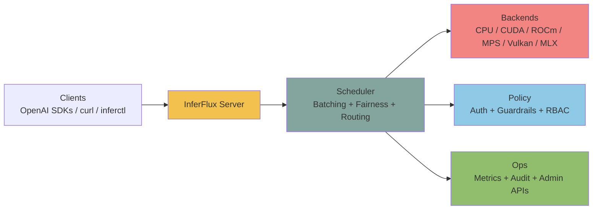
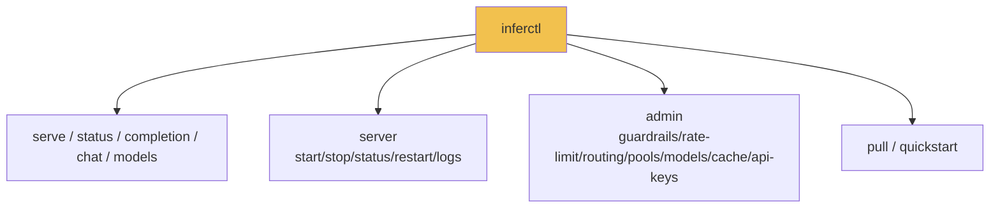

# InferFlux

> High-throughput inference server for edge and on-premise AI workloads.
> OpenAI-compatible APIs · Native CUDA kernels + llama.cpp · Meets or beats stock llama.cpp on AMD and NVIDIA

**Documentation: https://anvai-labs.github.io/inferflux/**

**Why InferFlux?** Small, quantized models (3B-30B) running on a single GPU can power dozens of concurrent AI tasks — but only if the serving layer doesn't bottleneck. InferFlux's C++ scheduler keeps decode batches full with wave-gathering admission and continuous batching. On an AMD Radeon AI PRO R9700 it serves every tested architecture at or above stock llama.cpp — **+51% on Qwen3-30B-A3B (MoE), +26% on LFM2.5-8B-A1B, +19% on gpt-oss-20b** at 16-way concurrency — while adding auth, policy, fairness, prefix caching, and Prometheus metrics that raw model servers don't have. Measured comparisons and methodology: [docs/COMPETITIVE_POSITIONING.md](docs/COMPETITIVE_POSITIONING.md).

**Use cases:**
- **Parallel email/document analysis** — 8 agents processing inboxes simultaneously on one RTX 4000
- **Support agent routing** — real-time intent classification and response drafting at scale
- **Market event scanning** — concurrent alert evaluation across multiple data feeds
- **Cybersecurity** — parallel log analysis, threat detection, and anomaly scoring on edge devices
- **IoT / video analytics** — edge inference for camera feeds, sensor fusion, real-time alerting
- **Task orchestration** — multiple AI agents making independent decisions in parallel

**Integration:** Drop-in replacement for any OpenAI-compatible client. Point `OPENAI_BASE_URL` at InferFlux and existing code works unchanged:
- **[Victor](https://github.com/anvai-labs/victor)** — agentic AI framework with 24 providers. InferFlux as the local provider — measured at or above stock llama.cpp on every tested model class
- **LangChain / LlamaIndex / openai-python** — use InferFlux as any OpenAI-compatible endpoint
- **NVIDIA RTX 4000 Ada** — workstation GPUs serving quantized models from 3B dense to 30B MoE at high concurrency



## Benchmarks (verified Sep 13 2026)

AMD Radeon AI PRO R9700 (32 GB, ROCm 7.2) · Qwen2.5-3B Q4_K_M · 48 requests × 256 tokens, greedy, 16 concurrent · vs a stock llama.cpp server built from the same pinned source:

| Model | Stock llama.cpp c=16 | InferFlux c=16 | Δ |
|---|---:|---:|---|
| Qwen2.5-3B (dense) | 992 tok/s | **1067 tok/s** | +8% |
| LFM2.5-8B-A1B (hybrid MoE) | 861 tok/s | **1089 tok/s** | +26% |
| gpt-oss-20b MXFP4 (MoE) | 598 tok/s | **710 tok/s** | +19% |
| Qwen3-30B-A3B (MoE) | 498 tok/s | **750 tok/s** | +51% |
| Qwen3-14B (dense) | 391 tok/s | 388 tok/s | parity |

Kernel-level correctness on the AMD GPU: 11,054/11,054 llama.cpp backend ops passed. NVIDIA RTX 4000 Ada CUDA numbers (native first-party kernels vs the llama.cpp wrapper, dated Sep 4-8 2026) and the safetensors comparison against vLLM/SGLang: [docs/benchmarks.md](docs/benchmarks.md) and [docs/COMPETITIVE_POSITIONING.md](docs/COMPETITIVE_POSITIONING.md).

### Why InferFlux stays fast at concurrency

| | InferFlux | Typical per-request servers |
|---|---|---|
| **Batching** | Continuous batching with wave-gathering admission — decode batches stay full as requests arrive | Rosters launch per arrival wave; solo requests hold the worker |
| **Scheduling** | Priority/age, LPM, throughput-balanced selection, chunked prefill, fairness yield/resume | First-come-first-served |
| **Reuse** | Radix prefix cache with backend-verified KV consistency | Per-request prefill |
| **Surface** | Auth, policy/guardrails, fairness, Prometheus metrics, audit log around the same llama.cpp library | Raw model serving |

## OSS Release Snapshot

| Area | What ships in this repo |
|---|---|
| Server binary | `inferfluxd` |
| CLI binary | `inferctl` |
| API surface | `/v1/completions`, `/v1/chat/completions`, `/v1/models`, `/v1/models/{id}`, `/v1/embeddings`, `/v1/admin/*` |
| Runtime options | CPU + optional CUDA/ROCm/MPS/Vulkan/MLX |
| Ops endpoints | `/livez`, `/readyz`, `/healthz`, `/metrics`, optional `/ui` |
| OSS metadata | `LICENSE`, `CONTRIBUTING.md`, `SECURITY.md`, `CODE_OF_CONDUCT.md` |

## Current Reality

| State | Reading |
|---|---|
| Proven (ROCm, Sep 13) | Meets or beats stock llama.cpp on every tested architecture (dense parity, MoE +19-51%); hybrid-attention models fully supported |
| Proven (CUDA) | 50+ fused GEMV kernels, FlashAttention-2, MMA decode; native `inferflux_cuda` leads the wrapper up to 1.56× at c=16 on short-completion workloads |
| Strong today | API/admin/CLI contracts, backend identity, chat template rendering, GGUF metadata API, fairness, prefix cache |
| Still open | Safetensors decode gap vs vLLM/SGLang (measured, profiled — see docs/benchmarks.md), native structured output |

## Design Principles

| Principle | Reading |
|---|---|
| Throughput | Continuous batching with wave-gathering admission keeps decode batches full |
| Quality | Chat template auto-detected from GGUF metadata; greedy determinism verified; per-request sampling |
| Memory | Quantized GGUF stays quantized; KV budgets sized per slot; honest slot lifecycle |
| Backend selection | `llama_cpp_*` for the broadest model coverage; native `inferflux_cuda` for first-party kernel work |

## 3-Minute Bring-Up

```bash
# 1) Build
./scripts/build.sh

# Optional: target Ada RTX 4000 specifically
# INFERFLUX_CUDA_ARCHS=89 ./scripts/build.sh

# 2) Run server
INFERFLUX_MODEL_PATH=models/Meta-Llama-3-8B-Instruct.Q4_K_M.gguf \
  ./build/inferfluxd --config config/server.yaml

# 3) Send request
./build/inferctl completion \
  --prompt "Explain why batching improves throughput" \
  --max-tokens 64 \
  --api-key dev-key-123
```

## API Surface

| Scope | Endpoint | Method |
|---|---|---|
| Health | `/livez`, `/readyz`, `/healthz` | `GET` |
| Metrics | `/metrics` | `GET` |
| OpenAI | `/v1/completions`, `/v1/chat/completions` | `POST` |
| OpenAI | `/v1/models`, `/v1/models/{id}` | `GET` |
| OpenAI | `/v1/embeddings` | `POST` |
| Admin | `/v1/admin/guardrails` | `GET`, `PUT` |
| Admin | `/v1/admin/rate_limit` | `GET`, `PUT` |
| Admin | `/v1/admin/api_keys` | `GET`, `POST`, `DELETE` |
| Admin | `/v1/admin/models` | `GET`, `POST`, `DELETE` |
| Admin | `/v1/admin/models/default` | `PUT` |
| Admin | `/v1/admin/routing` | `GET`, `PUT` |
| Admin | `/v1/admin/cache`, `/v1/admin/cache/warm` | `GET`, `POST` |

Full API map: [docs/API_SURFACE.md](docs/API_SURFACE.md)

## CLI Surface



## Documentation

Start here: [docs/INDEX.md](docs/INDEX.md)

Performance and runtime:
- [docs/benchmarks.md](docs/benchmarks.md)
- [docs/MONITORING.md](docs/MONITORING.md)
- [docs/TechDebt_and_Competitive_Roadmap.md](docs/TechDebt_and_Competitive_Roadmap.md)
- [docs/Roadmap.md](docs/Roadmap.md)

Architecture:
- [docs/GEMV_KERNEL_ARCHITECTURE.md](docs/GEMV_KERNEL_ARCHITECTURE.md)
- [docs/GGUF_NATIVE_KERNEL_IMPLEMENTATION.md](docs/GGUF_NATIVE_KERNEL_IMPLEMENTATION.md)
- [docs/Architecture.md](docs/Architecture.md)

## Project Status

- Done: production-ready HTTP server with OpenAI-compatible APIs
- Done: multi-backend runtime across CPU and optional GPU providers
- Done: operator-grade auth, RBAC, metrics, audit, and admin surfaces
- Done: documented `llama_cpp_cuda` advantage over Ollama on the published concurrent GGUF benchmark
- In progress: `inferflux_cuda` concurrency work, especially decode down-proj row-pair and row-quad kernels
- In progress: distributed runtime ownership and failure maturity

## Quick Links

- Benchmarks: [docs/benchmarks.md](docs/benchmarks.md)
- Configuration: [config/server.yaml](config/server.yaml)
- Build: [scripts/build.sh](scripts/build.sh)
- Tests: `ctest --test-dir build`

## License

Apache License 2.0. See [LICENSE](LICENSE).
