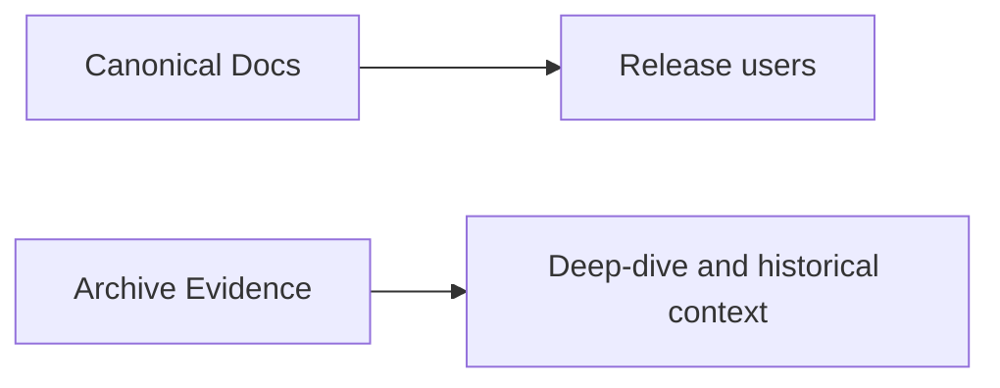

# Archive Index (Reference Evidence)

**Status:** Active (reference-only)

## Archive Policy

| Label | Meaning |
|---|---|
| `Reference-Evidence` | historical benchmark/debug/design context |
| `Canonical-Elsewhere` | source of truth moved to canonical docs |

> **Note:** the `archive/evidence/` document tree was removed from the
> repository; the entries below are retained as a historical catalog of
> what existed and where its canonical replacement lives. Names are no
> longer links.

## 1) Performance and Benchmark Evidence

| Document | Label | Notes |
|---|---|---|
| NATIVE_CUDA_BENCHMARK_GUIDE | Reference-Evidence | benchmark procedure |
| NATIVE_vs_LLAMA_CPP_CUDA_BENCHMARK | Reference-Evidence | native vs universal snapshot |
| QWEN14B_PREFILL_BATCH_MATRIX_2026_03_06 | Reference-Evidence | prefill and batching contrast snapshot (native vs llama CUDA) |
| COMPLETE_STRESS_TEST_REPORT_2026_03_04 | Reference-Evidence | stress/debug summary |
| GGUF_COMPLETE_IMPLEMENTATION_2026_03_04 | Reference-Evidence | GGUF milestone snapshot |
| GGUF_CONCURRENT_PROFILING_RESULTS_2026_03_05 | Reference-Evidence | GGUF concurrent throughput snapshot |
| GGUF_PROFILING_QUICK_REFERENCE_2026_03_05 | Reference-Evidence | GGUF quick tuning snapshot |
| FLASHATTENTION_LIVE_TEST_RESULTS_2025_03_02 | Reference-Evidence | FlashAttention validation snapshot |
| throughput-investigations/README | Reference-Evidence | archived Sprint 2 throughput, profiling, and vectorized-load investigation cluster |
| FP16_MODEL_GUIDE_2026_03_05 | Reference-Evidence | FP16 sizing and backend guidance snapshot |
| FP16_BENCHMARK_RESULTS_FINAL_2026_03_05 | Reference-Evidence | FP16 benchmark results snapshot |
| FP16_CONCURRENT_BENCHMARK_FINAL_2026_03_05 | Reference-Evidence | FP16 concurrent benchmark snapshot |
| FP16_OOM_FIX_VALIDATION_2026_03_05 | Reference-Evidence | FP16 OOM-fix validation snapshot |
| FP16_OOM_FIX_FINAL_SUMMARY_2026_03_05 | Reference-Evidence | FP16 OOM-fix implementation summary snapshot |
| FP16_OOM_ROOT_CAUSE_ANALYSIS_2026_03_05 | Reference-Evidence | FP16 OOM root-cause analysis snapshot |
| PERFORMANCE_OPTIMIZATION_SUMMARY_2026_03_05 | Reference-Evidence | Consolidated performance notes snapshot |
| NSIGHT_QWEN3_VS_TINYLLAMA_COMPARISON | Reference-Evidence | Nsight comparison |
| GPU_OPTIMIZATION_FINDINGS_2026_03_03 | Reference-Evidence | optimization findings |
| ROCM_BACKEND_IMPLEMENTATION_PLAN | Reference-Evidence | ROCm planning context |

## 2) Consolidated Product Narrative Snapshots

| Document | Label | Canonical replacement |
|---|---|---|
| VISION_2026_03_05 | Canonical-Elsewhere | [PRD](PRD.md), [Roadmap](Roadmap.md), [TechDebt](TechDebt_and_Competitive_Roadmap.md) |
| COMPETITIVE_POSITIONING_2026_03_05 | Canonical-Elsewhere | [PRD](PRD.md), [TechDebt](TechDebt_and_Competitive_Roadmap.md) |
| NFR_2026_03_05 | Canonical-Elsewhere | [PRD](PRD.md), [Roadmap](Roadmap.md) |
| BACKEND_RENAME_VERIFICATION_2026_03_05 | Reference-Evidence | rename verification snapshot; canonical naming now lives in [design/backend_naming_strategy](design/backend_naming_strategy.md) plus current config/API docs |

## 3) Consolidated Operations and Tuning Deep-Dives

| Document | Label | Canonical replacement |
|---|---|---|
| PERFORMANCE_TUNING_2026_03_05 | Canonical-Elsewhere | [MONITORING](MONITORING.md), [CONFIG_REFERENCE](CONFIG_REFERENCE.md) |
| PROFILING_OPERATIONS_GUIDE_2026_03_05 | Canonical-Elsewhere | [MONITORING](MONITORING.md), [Developer Guide](DeveloperGuide.md) |
| INFERCTL_SERVER_MANAGEMENT_2026_03_05 | Canonical-Elsewhere | [AdminGuide](AdminGuide.md) |

## 4) Consolidated GGUF Deep-Dives

| Document | Label | Canonical replacement |
|---|---|---|
| GGUF_NATIVE_KERNEL_IMPLEMENTATION_2026_03_05 | Canonical-Elsewhere | [GGUF_NATIVE_KERNEL_IMPLEMENTATION](GGUF_NATIVE_KERNEL_IMPLEMENTATION.md) |
| GGUF_QUANTIZATION_REFERENCE_2026_03_05 | Canonical-Elsewhere | [GGUF_NATIVE_KERNEL_IMPLEMENTATION](GGUF_NATIVE_KERNEL_IMPLEMENTATION.md), [GGUF_SMOKE_TEST_GUIDE](GGUF_SMOKE_TEST_GUIDE.md) |
| GGUF_SMOKE_TEST_GUIDE_2026_03_05 | Canonical-Elsewhere | [GGUF_SMOKE_TEST_GUIDE](GGUF_SMOKE_TEST_GUIDE.md) |

## 5) Consolidated Startup Advisor Deep-Dives

| Document | Label | Canonical replacement |
|---|---|---|
| DYNAMIC_SLOT_ALLOCATION_STARTUP_ADVISOR_2026_03_05 | Canonical-Elsewhere | [STARTUP_ADVISOR](STARTUP_ADVISOR.md), [CONFIG_REFERENCE](CONFIG_REFERENCE.md) |
| STARTUP_ADVISOR_DYNAMIC_SLOTS_SUMMARY_2026_03_05 | Canonical-Elsewhere | [STARTUP_ADVISOR](STARTUP_ADVISOR.md), [CONFIG_REFERENCE](CONFIG_REFERENCE.md) |
| STARTUP_ADVISOR_CONFIGURABLE_CONSTANTS_2026_03_05 | Canonical-Elsewhere | [STARTUP_ADVISOR](STARTUP_ADVISOR.md), [CONFIG_REFERENCE](CONFIG_REFERENCE.md) |
| LARGE_CONTEXT_CONFIGURATION_GUIDE_2026_03_05 | Canonical-Elsewhere | [CONFIG_REFERENCE](CONFIG_REFERENCE.md), [STARTUP_ADVISOR](STARTUP_ADVISOR.md) |

## 6) 2026-09-04 Docs Reconciliation — Redirect Stubs Retired

These top-level docs had already been reduced to thin "Consolidated" redirect
stubs pointing at canonical docs (some also carried dangling links to
`archive/evidence/*.md` snapshots removed in an earlier pass). The stubs
added no information beyond the redirect, so they were deleted outright and
their few live referrers repointed directly at the canonical doc.

| Document | Label | Canonical replacement |
|---|---|---|
| NFR | Canonical-Elsewhere | [PRD](PRD.md), [Roadmap](Roadmap.md), [TechDebt](TechDebt_and_Competitive_Roadmap.md) |
| PERFORMANCE_TUNING | Canonical-Elsewhere | [MONITORING](MONITORING.md), [CONFIG_REFERENCE](CONFIG_REFERENCE.md), [STARTUP_ADVISOR](STARTUP_ADVISOR.md), [benchmark_multi_backend_steps](benchmark_multi_backend_steps.md) |
| INFERCTL_SERVER_MANAGEMENT | Canonical-Elsewhere | [AdminGuide](AdminGuide.md) |
| PROFILING_OPERATIONS_GUIDE | Canonical-Elsewhere | [MONITORING](MONITORING.md), [DeveloperGuide](DeveloperGuide.md) |
| GGUF_QUANTIZATION_REFERENCE | Canonical-Elsewhere | [GGUF_NATIVE_KERNEL_IMPLEMENTATION](GGUF_NATIVE_KERNEL_IMPLEMENTATION.md), [GGUF_SMOKE_TEST_GUIDE](GGUF_SMOKE_TEST_GUIDE.md) |
| FP16_MODEL_GUIDE | Canonical-Elsewhere | [FP16_STATUS](FP16_STATUS.md) |
| FP16_BENCHMARK_RESULTS_FINAL | Canonical-Elsewhere | [FP16_STATUS](FP16_STATUS.md), [benchmarks](benchmarks.md) |
| FP16_OOM_FIX_FINAL_SUMMARY | Canonical-Elsewhere | [FP16_STATUS](FP16_STATUS.md) |
| FP16_OOM_FIX_VALIDATION | Canonical-Elsewhere | [FP16_STATUS](FP16_STATUS.md) |
| OOM_ROOT_CAUSE_ANALYSIS | Canonical-Elsewhere | [FP16_STATUS](FP16_STATUS.md) |
| PERFORMANCE_OPTIMIZATION_SUMMARY | Canonical-Elsewhere | [FP16_STATUS](FP16_STATUS.md), [benchmarks](benchmarks.md) |
| LARGE_CONTEXT_CONFIGURATION_GUIDE | Canonical-Elsewhere | [CONFIG_REFERENCE](CONFIG_REFERENCE.md), [STARTUP_ADVISOR](STARTUP_ADVISOR.md) |
| DYNAMIC_SLOT_ALLOCATION_STARTUP_ADVISOR | Canonical-Elsewhere | [STARTUP_ADVISOR](STARTUP_ADVISOR.md), [CONFIG_REFERENCE](CONFIG_REFERENCE.md) |
| STARTUP_ADVISOR_CONFIGURABLE_CONSTANTS_2026_03_04 | Canonical-Elsewhere | [STARTUP_ADVISOR](STARTUP_ADVISOR.md), [CONFIG_REFERENCE](CONFIG_REFERENCE.md) |
| STARTUP_ADVISOR_DYNAMIC_SLOTS_SUMMARY | Canonical-Elsewhere | [STARTUP_ADVISOR](STARTUP_ADVISOR.md), [CONFIG_REFERENCE](CONFIG_REFERENCE.md) |
| FLASHATTENTION_QUICKSTART | Canonical-Elsewhere | [GEMV_KERNEL_ARCHITECTURE](GEMV_KERNEL_ARCHITECTURE.md), [benchmarks](benchmarks.md) |
| ARCHITECTURE_COMPARISON | Canonical-Elsewhere | [benchmarks](benchmarks.md), [COMPETITIVE_POSITIONING](COMPETITIVE_POSITIONING.md) |

## 7) 2026-09-04 Docs Reconciliation — Completed Investigation and Milestone Snapshots

One-off dated investigation results and completed-task summaries, superseded
by the current state of the canonical docs and code they investigated.

| Document | Label | Notes |
|---|---|---|
| GITHUB_CI_GGUF_QUANTIZATION_TESTS_2026_03_05 | Reference-Evidence | GGUF CI job rollout snapshot; current jobs live in `.github/workflows/ci.yml` |
| UNIT_TESTS_GGUF_QUANTIZATION_2026_03_05 | Reference-Evidence | GGUF quantization unit-test milestone snapshot |
| WORK_SUMMARY_2026_03_05_GGUF_CI_COMPLETE | Reference-Evidence | GGUF CI completion summary |
| LOGIT_BIAS_IMPLEMENTATION_2026_03_06 | Reference-Evidence | logit_bias implementation completion snapshot |
| FP16_DEPLOYMENT_TEST_RESULTS_2026_03_05 | Reference-Evidence | FP16 deployment smoke-test snapshot |
| HTTP_WORKER_POOL_INCREASE | Reference-Evidence | HTTP worker pool sizing change snapshot |
| GPU_KERNEL_PROFILING_RESULTS | Reference-Evidence | kernel profiling root-cause snapshot |
| BATCH_ACCUMULATION_TEST_RESULTS | Reference-Evidence | batch accumulation tuning result snapshot |
| CONCURRENT_THROUGHPUT_SUMMARY | Reference-Evidence | concurrent throughput investigation summary |
| CONCURRENT_THROUGHPUT_INVESTIGATION | Reference-Evidence | concurrent throughput deep-dive; see [benchmarks](benchmarks.md) |
| Q8_1_ROWPAIR_INVESTIGATION | Reference-Evidence | row-pair Q8_1 kernel investigation snapshot |
| atomic_add_optimization_analysis | Reference-Evidence | atomicAdd optimization analysis snapshot |
| fp32_accumulate_fix | Reference-Evidence | FP32 accumulation fix snapshot |
| fp32_fix_validation_results | Reference-Evidence | FP32 fix validation snapshot |
| hybrid_kv_cache_status | Reference-Evidence | hybrid KV cache implementation status snapshot |
| investigation_summary | Reference-Evidence | stochastic-sampling investigation snapshot |
| next_steps_summary | Reference-Evidence | cross-cutting next-steps analysis snapshot |
| optimization_summary_april2026 | Reference-Evidence | FP32 residual / atomicAdd optimization summary |
| benchmark_analysis_post_fix | Reference-Evidence | post-fix benchmark analysis snapshot |
| PROFILING_ANALYSIS_2026_03_18 | Reference-Evidence | dated profiling analysis snapshot |
| PROFILING_ANALYSIS_2026_03_22 | Reference-Evidence | dated profiling analysis snapshot |
| FFN_FUSION_ANALYSIS | Reference-Evidence | FFN fusion feasibility analysis snapshot |
| FFN_FUSION_BLOCKED | Reference-Evidence | FFN fusion rollout-rejection snapshot |
| FFN_FUSION_STATUS | Reference-Evidence | FFN fusion status snapshot; see [benchmarks](benchmarks.md) for current operator readings |

## Canonical Sources of Truth

- [README](../README.md)
- [INDEX](INDEX.md)
- [Quickstart](Quickstart.md)
- [API Surface](API_SURFACE.md)
- [Architecture](Architecture.md)
- [PRD](PRD.md)
- [Roadmap](Roadmap.md)
- [TechDebt and Competitive Roadmap](TechDebt_and_Competitive_Roadmap.md)
