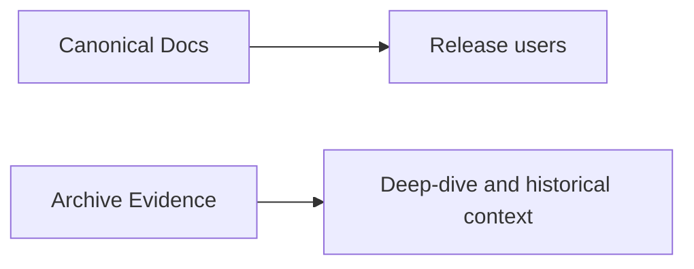

# Archive Index (Reference Evidence)

**Status:** Active (reference-only)

## Archive Policy

| Label | Meaning |
|---|---|
| `Reference-Evidence` | historical benchmark/debug/design context |
| `Canonical-Elsewhere` | source of truth moved to canonical docs |

> **Note:** the `archive/evidence/` document tree was removed from the
> repository; the entries below are retained as a historical catalog of
> what existed and where its canonical replacement lives. Names are no
> longer links.

## 1) Performance and Benchmark Evidence

| Document | Label | Notes |
|---|---|---|
| NATIVE_CUDA_BENCHMARK_GUIDE | Reference-Evidence | benchmark procedure |
| NATIVE_vs_LLAMA_CPP_CUDA_BENCHMARK | Reference-Evidence | native vs universal snapshot |
| QWEN14B_PREFILL_BATCH_MATRIX_2026_03_06 | Reference-Evidence | prefill and batching contrast snapshot (native vs llama CUDA) |
| COMPLETE_STRESS_TEST_REPORT_2026_03_04 | Reference-Evidence | stress/debug summary |
| GGUF_COMPLETE_IMPLEMENTATION_2026_03_04 | Reference-Evidence | GGUF milestone snapshot |
| GGUF_CONCURRENT_PROFILING_RESULTS_2026_03_05 | Reference-Evidence | GGUF concurrent throughput snapshot |
| GGUF_PROFILING_QUICK_REFERENCE_2026_03_05 | Reference-Evidence | GGUF quick tuning snapshot |
| FLASHATTENTION_LIVE_TEST_RESULTS_2025_03_02 | Reference-Evidence | FlashAttention validation snapshot |
| throughput-investigations/README | Reference-Evidence | archived Sprint 2 throughput, profiling, and vectorized-load investigation cluster |
| FP16_MODEL_GUIDE_2026_03_05 | Reference-Evidence | FP16 sizing and backend guidance snapshot |
| FP16_BENCHMARK_RESULTS_FINAL_2026_03_05 | Reference-Evidence | FP16 benchmark results snapshot |
| FP16_CONCURRENT_BENCHMARK_FINAL_2026_03_05 | Reference-Evidence | FP16 concurrent benchmark snapshot |
| FP16_OOM_FIX_VALIDATION_2026_03_05 | Reference-Evidence | FP16 OOM-fix validation snapshot |
| FP16_OOM_FIX_FINAL_SUMMARY_2026_03_05 | Reference-Evidence | FP16 OOM-fix implementation summary snapshot |
| FP16_OOM_ROOT_CAUSE_ANALYSIS_2026_03_05 | Reference-Evidence | FP16 OOM root-cause analysis snapshot |
| PERFORMANCE_OPTIMIZATION_SUMMARY_2026_03_05 | Reference-Evidence | Consolidated performance notes snapshot |
| NSIGHT_QWEN3_VS_TINYLLAMA_COMPARISON | Reference-Evidence | Nsight comparison |
| GPU_OPTIMIZATION_FINDINGS_2026_03_03 | Reference-Evidence | optimization findings |
| ROCM_BACKEND_IMPLEMENTATION_PLAN | Reference-Evidence | ROCm planning context |

## 2) Consolidated Product Narrative Snapshots

| Document | Label | Canonical replacement |
|---|---|---|
| VISION_2026_03_05 | Canonical-Elsewhere | [PRD](PRD.md), [Roadmap](Roadmap.md), [TechDebt](TechDebt_and_Competitive_Roadmap.md) |
| COMPETITIVE_POSITIONING_2026_03_05 | Canonical-Elsewhere | [PRD](PRD.md), [TechDebt](TechDebt_and_Competitive_Roadmap.md) |
| NFR_2026_03_05 | Canonical-Elsewhere | [PRD](PRD.md), [Roadmap](Roadmap.md) |
| BACKEND_RENAME_VERIFICATION_2026_03_05 | Reference-Evidence | rename verification snapshot; canonical naming now lives in [design/backend_naming_strategy](design/backend_naming_strategy.md) plus current config/API docs |

## 3) Consolidated Operations and Tuning Deep-Dives

| Document | Label | Canonical replacement |
|---|---|---|
| PERFORMANCE_TUNING_2026_03_05 | Canonical-Elsewhere | [MONITORING](MONITORING.md), [CONFIG_REFERENCE](CONFIG_REFERENCE.md) |
| PROFILING_OPERATIONS_GUIDE_2026_03_05 | Canonical-Elsewhere | [MONITORING](MONITORING.md), [Developer Guide](DeveloperGuide.md) |
| INFERCTL_SERVER_MANAGEMENT_2026_03_05 | Canonical-Elsewhere | [AdminGuide](AdminGuide.md) |

## 4) Consolidated GGUF Deep-Dives

| Document | Label | Canonical replacement |
|---|---|---|
| GGUF_NATIVE_KERNEL_IMPLEMENTATION_2026_03_05 | Canonical-Elsewhere | [GGUF_NATIVE_KERNEL_IMPLEMENTATION](GGUF_NATIVE_KERNEL_IMPLEMENTATION.md) |
| GGUF_QUANTIZATION_REFERENCE_2026_03_05 | Canonical-Elsewhere | [GGUF_NATIVE_KERNEL_IMPLEMENTATION](GGUF_NATIVE_KERNEL_IMPLEMENTATION.md), [GGUF_SMOKE_TEST_GUIDE](GGUF_SMOKE_TEST_GUIDE.md) |
| GGUF_SMOKE_TEST_GUIDE_2026_03_05 | Canonical-Elsewhere | [GGUF_SMOKE_TEST_GUIDE](GGUF_SMOKE_TEST_GUIDE.md) |

## 5) Consolidated Startup Advisor Deep-Dives

| Document | Label | Canonical replacement |
|---|---|---|
| DYNAMIC_SLOT_ALLOCATION_STARTUP_ADVISOR_2026_03_05 | Canonical-Elsewhere | [STARTUP_ADVISOR](STARTUP_ADVISOR.md), [CONFIG_REFERENCE](CONFIG_REFERENCE.md) |
| STARTUP_ADVISOR_DYNAMIC_SLOTS_SUMMARY_2026_03_05 | Canonical-Elsewhere | [STARTUP_ADVISOR](STARTUP_ADVISOR.md), [CONFIG_REFERENCE](CONFIG_REFERENCE.md) |
| STARTUP_ADVISOR_CONFIGURABLE_CONSTANTS_2026_03_05 | Canonical-Elsewhere | [STARTUP_ADVISOR](STARTUP_ADVISOR.md), [CONFIG_REFERENCE](CONFIG_REFERENCE.md) |
| LARGE_CONTEXT_CONFIGURATION_GUIDE_2026_03_05 | Canonical-Elsewhere | [CONFIG_REFERENCE](CONFIG_REFERENCE.md), [STARTUP_ADVISOR](STARTUP_ADVISOR.md) |

## Canonical Sources of Truth

- [README](../README.md)
- [INDEX](INDEX.md)
- [Quickstart](Quickstart.md)
- [API Surface](API_SURFACE.md)
- [Architecture](Architecture.md)
- [PRD](PRD.md)
- [Roadmap](Roadmap.md)
- [TechDebt and Competitive Roadmap](TechDebt_and_Competitive_Roadmap.md)
