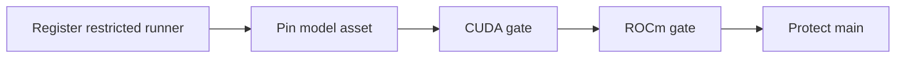

# Trusted Dual-GPU CI Bootstrap

**Status:** Runner registered and staged; workflow promotion pending



## Required Infrastructure

| Item | Contract |
|---|---|
| Runner | Dedicated Linux x64 runner labeled `self-hosted,linux,x64,gpu,cuda,rocm,dual-gpu` |
| NVIDIA | RTX 4000 Ada, compute capability 8.9, 20 GB |
| AMD | Radeon AI PRO R9700, `gfx1201`, 32 GB, ROCm 7.2 |
| Model | Read-only TinyLlama GGUF pinned by digest outside the repository |
| Toolchain | Pinned driver/CUDA/CMake versions recorded in job output |
| Isolation | Clean build and result directory per workflow run |

## Repository Configuration

1. Register one runner in `inferflux-gpu-trusted-staging`; do not register two
   agents that could contend for the same host.
2. Restrict the group to `gpu-gates.yml@refs/heads/main`. The workflow has no
   `pull_request` trigger, so public fork code never reaches the persistent host.
3. Set `INFERFLUX_GPU_MODEL_PATH` to a pinned runner-local GGUF model.
4. Run CUDA and then ROCm jobs; the shared runner serializes them.
5. Retain logs and raw evidence on success and failure.
6. Protect `main`; require hosted CPU checks on pull requests and require the
   dual-GPU workflow as post-merge/release evidence.

## WSL Listener Lifecycle

The current WSL execution environment has no systemd bus, so the runner's
`svc.sh install/start` path is unavailable. Registration is persistent, but the
listener must be started again after each host restart:

```bash
cd /home/vsingh/actions-runner-inferflux-gpu
./run.sh
```

Keep that command in a durable host terminal. Confirm GitHub reports the runner
online before enabling a gate:

```bash
gh api orgs/anvai-labs/actions/runners/9054 \
  --jq '{name,status,busy,labels:[.labels[].name]}'
```

Do not rerun `config.sh` during ordinary startup. Recovery registration requires
a fresh token from `POST /orgs/anvai-labs/actions/runners/registration-token`
and these values: group `inferflux-gpu-trusted-staging`, name
`aiserver1-dual-gpu`, and labels
`gpu,cuda,rocm,dual-gpu,rtx4000-ada,radeon-ai-pro-r9700,compute-89,gfx1201,gpu-20gb,gpu-32gb`.
Never write the token to documentation, logs, or source control.

## Promotion Gate

Do not close TD-002 merely because the workflow file contains GPU jobs. Close it
only after GitHub reports the configured runner, the model variable is present,
three consecutive CUDA+ROCm runs pass, and the release process requires their
stable names.
