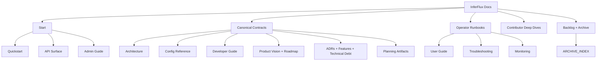

# InferFlux Docs Index (Canonical OSS)

> Fast map: canonical contracts first, deep dives second, archived evidence last.

## 1) Start Here

| Goal | Doc |
|---|---|
| First local run | [Quickstart](Quickstart.md) |
| API and auth contract | [API_SURFACE](API_SURFACE.md) |
| Admin/model operations | [AdminGuide](AdminGuide.md) |

## 2) Canonical Contracts (Source of Truth)

| Domain | Doc |
|---|---|
| Vision and product envelope | [PRODUCT](PRODUCT.md) |
| Runtime architecture | [Architecture](Architecture.md) |
| API surface | [API_SURFACE](API_SURFACE.md) |
| Configuration | [CONFIG_REFERENCE](CONFIG_REFERENCE.md) |
| Benchmark results and current CUDA reading | [benchmarks](benchmarks.md) |
| Multi-backend harness reference | [benchmarks](benchmarks.md) (harness appendix) |
| Monitoring and tuning | [MONITORING](MONITORING.md) |
| Archived throughput investigations | [ARCHIVE_INDEX](ARCHIVE_INDEX.md) |
| Developer workflow + CI contracts | [DeveloperGuide](DeveloperGuide.md) |
| Trusted CUDA + ROCm runner setup | [GPU_CI_BOOTSTRAP](GPU_CI_BOOTSTRAP.md) |
| Grades and execution plan | [Roadmap](Roadmap.md), [TechDebt_and_Competitive_Roadmap](TechDebt_and_Competitive_Roadmap.md) |
| Dependency-ordered product/design plan | [Roadmap](Roadmap.md), [Roadmap — Planning Principles](Roadmap.md#planning-principles-and-prioritization) |
| Architecture decisions | [adr/README](adr/README.md) |
| Feature specifications | [features/README](features/README.md) |
| Technical-debt register | [technical-debt/README](technical-debt/README.md) |
| Competitive positioning | [COMPETITIVE_POSITIONING](COMPETITIVE_POSITIONING.md) |
| GGUF runtime contract | [GGUF_NATIVE_KERNEL_IMPLEMENTATION](GGUF_NATIVE_KERNEL_IMPLEMENTATION.md) |
| FP16 / precision guidance | [benchmarks](benchmarks.md) |

## 3) Operator Runbooks

| Topic | Doc |
|---|---|
| User workflows | [UserGuide](UserGuide.md) |
| Incident triage | [Troubleshooting](Troubleshooting.md) |
| Release process | [ReleaseProcess](ReleaseProcess.md) |
| Installer/package flow | [Quickstart](Quickstart.md) |
| Startup sizing recommendations | [STARTUP_ADVISOR](STARTUP_ADVISOR.md) |
| GGUF smoke validation | `scripts/README.md` (GGUF native smoke) |
| ROCm on WSL install | [ROCM_INSTALLATION_GUIDE_WSL](ROCM_INSTALLATION_GUIDE_WSL.md) |
| Dev hardware + CI runner | [GPU_CI_BOOTSTRAP](GPU_CI_BOOTSTRAP.md) |

## 4) Contributor Deep Dives

| Topic | Doc |
|---|---|
| Backend implementation | [BACKEND_DEVELOPMENT](BACKEND_DEVELOPMENT.md) |
| Policy surface | [AdminGuide](AdminGuide.md) |
| Backend value matrix + parity principles | [Architecture](Architecture.md) |
| Native GGUF quantized runtime design | [design/NATIVE_GGUF_QUANTIZED_RUNTIME_ARCHITECTURE](design/NATIVE_GGUF_QUANTIZED_RUNTIME_ARCHITECTURE.md) |

## 5) Backlog and Evidence

| Need | Doc |
|---|---|
| Archived snapshots/benchmarks | [ARCHIVE_INDEX](ARCHIVE_INDEX.md) |

## 6) Grade Table Source

Use these two docs for current scoring and grade movement rationale:

- [Roadmap](Roadmap.md)
- [TechDebt_and_Competitive_Roadmap](TechDebt_and_Competitive_Roadmap.md)

Historical old-practice -> modern-practice migration guidance lives in the
[ARCHIVE_INDEX](ARCHIVE_INDEX.md) catalog (MODERNIZATION_AUDIT and
MAINTENANCE_REVIEW were removed as point-in-time audits).
