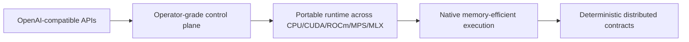
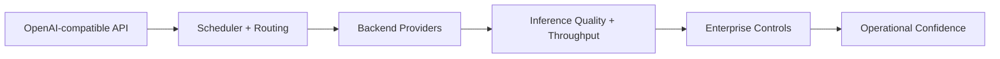
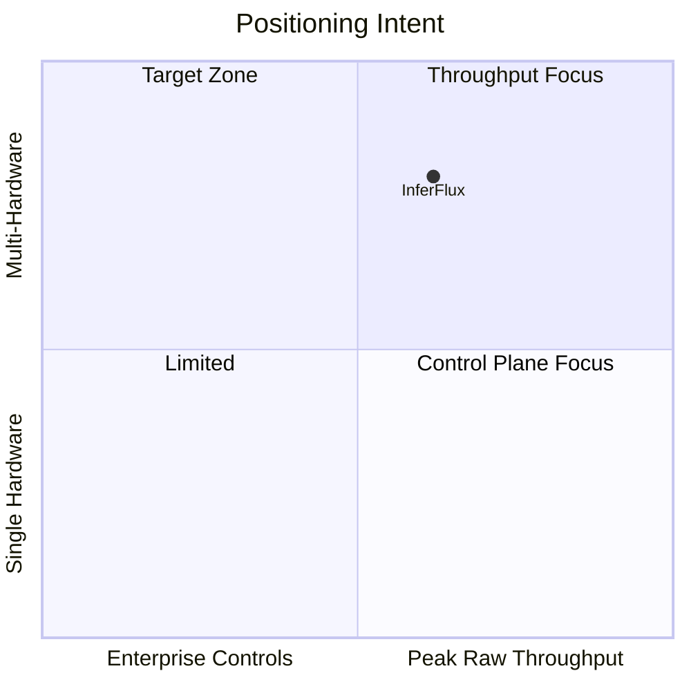

# InferFlux Product Vision and Envelope

**Snapshot date:** April 9, 2026

## 1) Product Contract

| Pillar | Concrete meaning |
|---|---|
| API compatibility | Core request/admin surfaces remain OpenAI-style and scriptable |
| Operator control plane | Auth, policy, routing, audit, metrics, and admin APIs are part of the product, not sidecars |
| Dual CUDA strategy | `inferflux_cuda` is the headroom path; `llama_cpp_cuda` is the compatibility/safety path |
| Memory economy | Shared weights, separate KV lifecycle, prefix reuse, and explicit memory policy knobs |
| Stateless default | Baseline API stays stateless; `session_id` reuse is optional and bounded |
| Honest scale path | Single-node rigor first, distributed claims only when lifecycle and failure contracts exist |

## 2) Current Reality

| State | Code-aligned reading |
|---|---|
| Strong today | API/admin/CLI contracts, backend/provider identity, policy-visible fallback, prefix/KV reuse, admin pools visibility, and operator observability |
| Foundation now | Native loader detection, memory-first GGUF dequant policy, KV auto-tune planning/metrics, optional session leases, distributed ticket lifecycle, timeout debt, optional fail-closed generation admission, and stepwise native burst decode on the live phased path |
| **Concurrency leadership (Sep 13)** | On the R9700 the wrapper meets or beats stock llama.cpp on every tested architecture (dense parity to +51% MoE at c=16); native CUDA leads the wrapper at c=16 on GGUF short completions (1.56x). Chat template auto-detection, repetition penalty, radix prefix cache, wave-gathering admission, greedy argmax fast path. Architecture: RAII, DIP, strategy pattern; full CPU test suite green. |

## 3) Modern Serving Posture

| Modern practice | InferFlux reading today | What still has to close |
|---|---|---|
| Sync batching over naive async fragmentation | Adopted | Only re-enable native async if it preserves the same batched execution core |
| Quantized serving as first-class runtime path | Adopted foundation | Finish fused GGUF hot paths so memory-first mode is also the fast path |
| Paged KV plus budget-aware planning | Adopted foundation | Mature allocator/ownership behavior under concurrency |
| PD disaggregation with transport health | Adopted foundation | Close sequence ownership, cleanup, and multi-process fault matrix |
| Explicit provider/fallback identity | Adopted | Keep every API/CLI/admin surface aligned as backends evolve |
| Contract gates before grade moves | Adopted stance | Add required GPU/provider lanes before claiming release-grade runtime maturity |

## 4) Old Practices to Retire

| Retire | Replace with |
|---|---|
| Hidden compatibility fallback | Explicit backend/provider/fallback metadata and policy decisions |
| “Async means faster” | Measure batch quality, hot-path residency, and end-to-end throughput |
| Persistent dequant buffers by default | Policy-scoped dequant with memory-first `none` as the native GGUF default |
| Fixed KV reservations | Budgeted KV planning with exported decisions |
| Passive readiness only | Readiness plus optional fail-closed admission where degraded transport should stop new generation work |
| Benchmark-only product claims | Contract tests plus representative runtime evidence |

## 5) Grade Stance

Current grades and the evidence behind them live in
[TechDebt_and_Competitive_Roadmap](TechDebt_and_Competitive_Roadmap.md);
next moves live in [Roadmap](Roadmap.md).

## 6) Canonical Source Map

| Need | Source of truth |
|---|---|
| Runtime contract | [Architecture](Architecture.md) |
| Grade and next moves | [Roadmap](Roadmap.md) |
| Debt and migration order | [TechDebt_and_Competitive_Roadmap](TechDebt_and_Competitive_Roadmap.md) |
| Modernization table | [ARCHIVE_INDEX](ARCHIVE_INDEX.md) (MODERNIZATION_AUDIT removed as a point-in-time audit) |
| Product envelope | [PRODUCT](PRODUCT.md) |

Archived long-form narratives stay under [ARCHIVE_INDEX](ARCHIVE_INDEX.md).

---

# Product Requirements

**Status:** Canonical  
**Snapshot date:** March 5, 2026

## 1) Product Contract

| Dimension | Requirement |
|---|---|
| Product category | Enterprise-ready inference server with OpenAI-compatible API |
| Primary value | One control plane across CPU/CUDA/ROCm/MPS paths |
| Core differentiator | Security + policy + observability integrated with serving path |
| Primary interfaces | `inferfluxd` HTTP API and `inferctl` CLI |
| Deployment intent | local dev, single-node GPU, Kubernetes |

## 2) Personas and KPI Targets

| Persona | Job-to-be-done | KPI target |
|---|---|---|
| OSS builder | Run first chat/completion quickly | time-to-first-response < 5 min from Quickstart |
| Platform engineer | Operate reliable inference tier | readiness/health contract + auditability enabled |
| Agent developer | Depend on structured output/tool paths | schema/tool contract pass rate >= 99% in integration gates |
| Enterprise operator | Enforce access + governance | scoped auth + policy + audit paths enabled by default |

## 3) Functional Scope (Must Have)

| Area | Requirement |
|---|---|
| Public API | `/v1/completions`, `/v1/chat/completions`, `/v1/models`, `/v1/models/{id}`, `/v1/embeddings` |
| Admin API | `/v1/admin/models`, `/v1/admin/models/default`, `/v1/admin/routing`, `/v1/admin/cache`, `/v1/admin/api_keys`, `/v1/admin/guardrails`, `/v1/admin/rate_limit` |
| Health/ops | `/livez`, `/readyz`, `/healthz`, `/metrics` |
| Runtime | phase-aware scheduling, capability routing, prefix/KV reuse, model lifecycle |
| Security | API key auth, scope checks (`generate/read/admin`), optional OIDC, audit logging |
| CLI | `inferctl` parity for user + admin contracts |

## 4) Non-Functional Gates (Release Quality)

| Gate | Requirement |
|---|---|
| Performance | batching/throughput guardrails must pass configured gate thresholds |
| Reliability | no-backend and capability failures are explicit and deterministic |
| Security | keys/scopes/policy/audit paths tested for expected failure behavior |
| Observability | Prometheus metrics available for scheduler, backend, and API health |
| Compatibility | OpenAI-style request/response contract preserved for core endpoints |

## 5) Competitive Intent (Execution Lens)

| Area | Current posture | Target posture |
|---|---|---|
| Throughput | improving; native GPU path leads the wrapper at c=16 on GGUF short completions; the safetensors decode gap vs vLLM/SGLang remains the tracked target | close sustained gap with GPU batching + KV reuse |
| Hardware coverage | strong baseline | maintain parity across CUDA/ROCm/MPS/Vulkan/MLX/CPU |
| Enterprise controls | strong | keep lead with strict contracts |
| CI contract enforcement | moderate-to-strong | mandatory GPU behavioral gate |

## 6) Delivery Phases

| Phase | Outcome | Primary references |
|---|---|---|
| Foundation | API/admin/CLI contracts hardened | [API Surface](API_SURFACE.md), [Developer Guide](DeveloperGuide.md) |
| Throughput core | GPU batching + KV efficiency + native policy correctness | [Roadmap](Roadmap.md), [TechDebt](TechDebt_and_Competitive_Roadmap.md), the archived issue-import snapshots (see ARCHIVE_INDEX) |
| Enterprise runtime | distributed failure contracts + operations maturity | [Admin Guide](AdminGuide.md), [Architecture](Architecture.md) |

## 7) Out of Scope

| Not included | Reason |
|---|---|
| Training/fine-tuning pipelines | serving platform focus |
| Custom frontend product | API/CLI-first OSS scope |
| Proprietary kernel stack rewrite | leverage existing backend foundations first |

## 8) Consolidation Notes

The previous long-form narratives are cataloged (name only, no working tree
copy) in [ARCHIVE_INDEX](ARCHIVE_INDEX.md).

Canonical sources for active planning:

- [Roadmap](Roadmap.md)
- [TechDebt and Competitive Roadmap](TechDebt_and_Competitive_Roadmap.md)
- [INDEX](INDEX.md)
