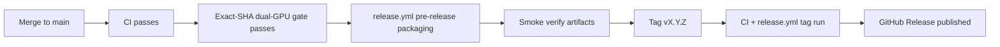
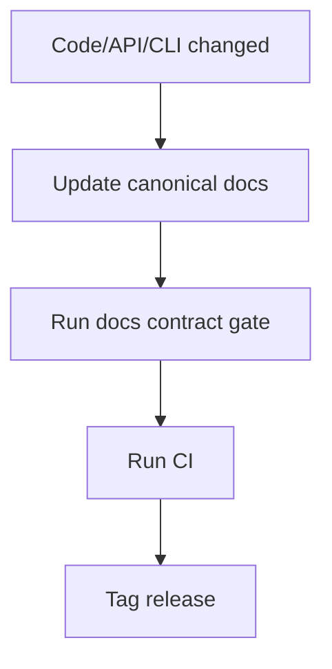

# Release Process (Canonical OSS)

**Status:** Canonical

## 1) Trigger Contract

| Trigger | Workflow path | Output |
|---|---|---|
| upstream push `CI` success on `main` | validated `release.yml` via `workflow_run` | pre-release artifacts (Linux/macOS/Windows + Homebrew metadata) |
| Push to `main` affecting runtime/GPU paths | `gpu-gates.yml` | exact-SHA CUDA + ROCm behavioral evidence |
| upstream push `CI` success on real `vX.Y.Z` tag | validated packaging + exact-SHA GPU evidence + release job | GitHub Release with installers + manifests |

## 2) Artifact Contract

| Platform | Artifacts |
|---|---|
| Linux x86_64 / aarch64 | `inferflux-<version>-Linux-<arch>.tar.gz`, `.deb`, `.rpm` |
| macOS arm64 | `inferflux-<version>-Darwin-arm64.tar.gz`, `.pkg`, `.dmg` |
| Windows x64 | `inferflux-<version>-Windows-AMD64.msi`, `.zip` |
| Package metadata | `homebrew/inferflux.rb`, `winget/inferencial.inferflux.yaml` |

## 3) Promotion Runbook

Prepare the release branch from the agreed develop revision before candidate CI. Record its
source SHA and independent review, then promote through the protected branch workflow.
Rebasing or adding runtime fixes invalidates earlier exact-revision evidence for promotion.
The current [v0.4.0 candidate record](releases/v0.4.0.md) distinguishes reviewed
endpoint-admission code from promotion, GPU, packaging and deployment gates. The
[v0.3.0 candidate record](releases/v0.3.0.md) preserves its historical pre-release evidence;
the published immutable tag and release artifacts are the release identity.

1. Merge to `main` and wait for green `CI`.
2. Confirm `Dual-GPU gate result` and both CUDA/ROCm runtime jobs actually succeeded for the same commit SHA; a disabled/skipped aggregate is insufficient.
3. Retain the matching `cuda-gate-<sha>` and `rocm-gate-<sha>` artifacts.
4. Confirm pre-release packaging completed from `release.yml` for that same main SHA.
5. Confirm every packaging job's installer/archive smoke passed before artifact upload.
6. Tag the tested commit: `git tag vX.Y.Z && git push origin vX.Y.Z`.
7. Confirm tagged run publishes a GitHub Release; verify assets and checksums.

If the promoted SHA did not match the GPU workflow path filter, manually
dispatch `GPU Behavioral Gates` on `main` before step 2.

CPU/stub conformance, independent source review, and mocked installer tests support candidate
readiness. They do not replace the actual GPU jobs or native installer/archive smoke. Consumer
releases and their installed-package checks remain separately versioned and independently gated.

### Release eligibility and recovery

The release workflow first runs the validator from the trusted default-branch revision,
with read-only permissions. It accepts only successful upstream **push** CI, backed by
the source-provenance artifact from the triggering CI run and attempt. Pull requests,
forks, schedules and branch names that resemble tags cannot authorize publication.
The actual tag (including annotated tags) must resolve to the tested SHA, that SHA must
be on main's ancestry, and its CMake version must match the stable `vX.Y.Z` tag.
Immediately before publication, the workflow resolves the actual tag again and fails
if it is missing or no longer points to that same tested SHA.

Main pre-release packaging may run while GPU checks are pending. Tagged packaging and
publication require a successful trusted-main GPU run for the exact SHA, both runtime
jobs and their model-backed steps, the aggregate, and nonexpired CUDA/ROCm artifacts.
GPU evidence is tied to one successful run and SHA; GitHub may retain successful jobs
from earlier attempts of that same run. A disabled aggregate with skipped runtime jobs
is not evidence. No infrastructure-exception override is implemented by the validator.

CI provenance is intentionally attempt-specific. After **rerun failed jobs**, it may be
absent for the new attempt; rerun the entire CI workflow to refresh it. If a GPU retry's
API job listing lacks either successful runtime job, rerun the entire GPU workflow.
Missing, expired, ambiguous or unavailable API evidence fails closed; do not bypass the
validator. A different candidate requires a new version tag and matching CI/GPU/package
evidence; never move an existing release tag.

Homebrew metadata pins the tested Git revision using Homebrew's recursive Git download
strategy, because GitHub source archives omit the required llama.cpp submodule. The
formula links bundled libraries statically and tests both binaries. Winget metadata is
generated only for tags and hashes the actual MSI. Package-manager metadata is attached
to the GitHub Release; this workflow does not submit it to Homebrew or Winget registries.

### Automated package smoke

`scripts/smoke_release_packages.py` fails packaging on missing/duplicate artifacts,
installation failure, missing binaries, unexpected exit status, or missing help output.
It executes each artifact's own binaries: `inferctl --help` prints `Usage:` and exits
**1**; `inferfluxd --help` prints `usage: inferfluxd` and exits **0**.

| Artifact | Hosted runner check before upload |
|---|---|
| Linux TGZ (x86_64/arm64) | Extract and run both binaries |
| Linux DEB (x86_64/arm64) | `apt-get install`, run installed binaries, remove package; CPack derives ABI dependencies |
| Linux RPM (x86_64/arm64) | `rpm --install --nodeps` into an isolated root, run installed binaries using Ubuntu libraries |
| macOS TGZ / DMG | Extract TGZ; verify and mount DMG, copy payload, run both binaries, detach |
| macOS PKG | Execute `installer -pkg ... -target /`, run installed binaries |
| Windows ZIP / MSI | Extract ZIP and run binaries; execute `msiexec /i`, run installed binaries, uninstall |

The RPM check verifies installer payload execution, **not RPM dependency resolution**:
Ubuntu's installed dependencies are tracked by dpkg. Fedora/RHEL compatibility needs
a separate check on that target distribution. Archive extraction and DMG copying are
not installer execution. These checks need no model and do not replace exact-SHA GPU
evidence, endpoint tests, signing/notarization, or clean-machine dependency validation.

## 4) Release Docs Gate (Must Pass)

| Check | Command |
|---|---|
| Canonical docs contract | `python3 scripts/check_docs_contract.py` |
| Unit/integration baseline | `ctest --test-dir build --output-on-failure --timeout 90` |
| Trusted accelerator evidence | `Dual-GPU gate result` for the promoted SHA |
| API + CLI docs consistency | covered by docs gate |

### GPU gate exception

A failed GPU assertion is never waived. If runner infrastructure is unavailable,
a repository administrator may record one release exception linked to an
incident, expiring within 24 hours. The release notes must omit accelerator
support claims, and the exact tag SHA must pass the gate before the next release.

## 5) Pre-Tag Checklist

- `README.md` reflects current binaries and endpoints.
- `README.md` benchmark claims distinguish published `llama_cpp_cuda` results from in-progress `inferflux_cuda` work.
- `docs/INDEX.md` links only valid canonical docs.
- `docs/Quickstart.md` commands are runnable.
- `docs/API_SURFACE.md` matches implemented endpoints.
- Root OSS files exist and are current: `LICENSE`, `CONTRIBUTING.md`, `SECURITY.md`, `CODE_OF_CONDUCT.md`.
- Local benchmark and profiling artifacts are ignored and excluded from the release cut.
- Exact-SHA CUDA and ROCm gate artifacts are retained for the promoted commit.
- [DOCS_STYLE_GUIDE](DOCS_STYLE_GUIDE.md) constraints are met.

## 6) References

- [Quickstart](Quickstart.md#installing-a-release-packages)
- [INDEX](INDEX.md)
- [DOCS_STYLE_GUIDE](DOCS_STYLE_GUIDE.md)
- [Trusted Dual-GPU CI Bootstrap](GPU_CI_BOOTSTRAP.md)
- [ADR-0005](adr/ADR-0005-trusted-gpu-release-evidence.md)
