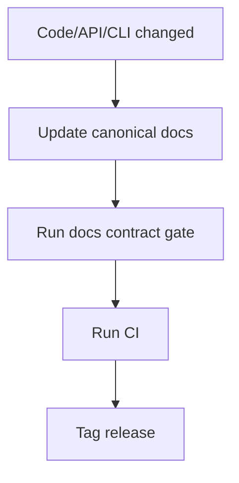

# Release Process (Canonical OSS)

**Status:** Canonical

## 1) Trigger Contract

| Trigger | Workflow path | Output |
|---|---|---|
| `CI` success on `main` | `release.yml` via `workflow_run` | pre-release artifacts (Linux/macOS/Windows + manifests) |
| Push to `main` affecting runtime/GPU paths | `gpu-gates.yml` | exact-SHA CUDA + ROCm behavioral evidence |
| `CI` success on `v*.*.*` tag | same packaging jobs + release job | GitHub Release with installers + manifests |

## 2) Artifact Contract

| Platform | Artifacts |
|---|---|
| Linux | `inferflux-<version>-Linux.tar.gz`, `.deb`, `.rpm` |
| macOS | `inferflux-<version>-Darwin.tar.gz`, `.pkg`, `.dmg` |
| Windows | `inferflux-<version>-win64.msi`, `.zip` |
| Package metadata | `homebrew/inferflux.rb`, `winget/inferencial.inferflux.yaml` |

## 3) Promotion Runbook

1. Merge to `main` and wait for green `CI`.
2. Confirm `Dual-GPU gate result` passed for the same commit SHA.
3. Retain the matching `cuda-gate-<sha>` and `rocm-gate-<sha>` artifacts.
4. Confirm pre-release packaging completed from `release.yml`.
5. Confirm every packaging job's installer/archive smoke passed before artifact upload.
6. Tag the tested commit: `git tag vX.Y.Z && git push origin vX.Y.Z`.
7. Confirm tagged run publishes a GitHub Release; verify assets and checksums.

If the promoted SHA did not match the GPU workflow path filter, manually
dispatch `GPU Behavioral Gates` on `main` before step 2.

### Automated package smoke

`scripts/smoke_release_packages.py` fails packaging on missing/duplicate artifacts,
installation failure, missing binaries, unexpected exit status, or missing help output.
It executes each artifact's own binaries: `inferctl --help` prints `Usage:` and exits
**1**; `inferfluxd --help` prints `usage: inferfluxd` and exits **0**.

| Artifact | Hosted runner check before upload |
|---|---|
| Linux TGZ (x86_64/arm64) | Extract and run both binaries |
| Linux DEB (x86_64/arm64) | `apt-get install`, run installed binaries, remove package; CPack derives ABI dependencies |
| Linux RPM (x86_64/arm64) | `rpm --install --nodeps` into an isolated root, run installed binaries using Ubuntu libraries |
| macOS TGZ / DMG | Extract TGZ; verify and mount DMG, copy payload, run both binaries, detach |
| macOS PKG | Execute `installer -pkg ... -target /`, run installed binaries |
| Windows ZIP / MSI | Extract ZIP and run binaries; execute `msiexec /i`, run installed binaries, uninstall |

The RPM check verifies installer payload execution, **not RPM dependency resolution**:
Ubuntu's installed dependencies are tracked by dpkg. Fedora/RHEL compatibility needs
a separate check on that target distribution. Archive extraction and DMG copying are
not installer execution. These checks need no model and do not replace exact-SHA GPU
evidence, endpoint tests, signing/notarization, or clean-machine dependency validation.

## 4) Release Docs Gate (Must Pass)

| Check | Command |
|---|---|
| Canonical docs contract | `python3 scripts/check_docs_contract.py` |
| Unit/integration baseline | `ctest --test-dir build --output-on-failure --timeout 90` |
| Trusted accelerator evidence | `Dual-GPU gate result` for the promoted SHA |
| API + CLI docs consistency | covered by docs gate |

### GPU gate exception

A failed GPU assertion is never waived. If runner infrastructure is unavailable,
a repository administrator may record one release exception linked to an
incident, expiring within 24 hours. The release notes must omit accelerator
support claims, and the exact tag SHA must pass the gate before the next release.

## 5) Pre-Tag Checklist

- `README.md` reflects current binaries and endpoints.
- `README.md` benchmark claims distinguish published `llama_cpp_cuda` results from in-progress `inferflux_cuda` work.
- `docs/INDEX.md` links only valid canonical docs.
- `docs/Quickstart.md` commands are runnable.
- `docs/API_SURFACE.md` matches implemented endpoints.
- Root OSS files exist and are current: `LICENSE`, `CONTRIBUTING.md`, `SECURITY.md`, `CODE_OF_CONDUCT.md`.
- Local benchmark and profiling artifacts are ignored and excluded from the release cut.
- Exact-SHA CUDA and ROCm gate artifacts are retained for the promoted commit.
- [DOCS_STYLE_GUIDE](DOCS_STYLE_GUIDE.md) constraints are met.

## 6) References

- [Quickstart](Quickstart.md#installing-a-release-packages)
- [INDEX](INDEX.md)
- [DOCS_STYLE_GUIDE](DOCS_STYLE_GUIDE.md)
- [Trusted Dual-GPU CI Bootstrap](GPU_CI_BOOTSTRAP.md)
- [ADR-0005](adr/ADR-0005-trusted-gpu-release-evidence.md)
