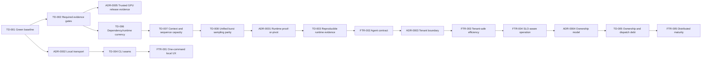
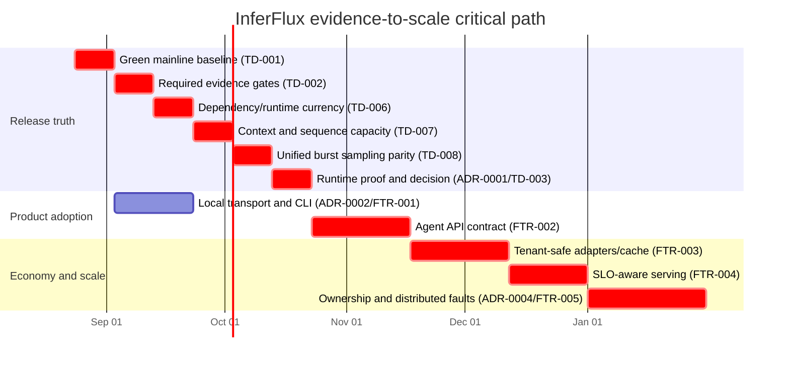

# InferFlux Product and Design Roadmap

**Status:** Proposed for co-design

**Planning epoch:** August 21, 2026

**Horizon:** 16 engineering weeks; sequencing is a dependency model, not a delivery promise

## Outcomes We Work Backward From

| Outcome | Release evidence |
|---|---|
| First useful response in under five minutes | Fresh-machine quickstart test and actionable failure diagnostics |
| Trustworthy agent execution | Structured output/tool contract pass rate >=99% across supported providers |
| Predictable cost and latency | TTFT, ITL, throughput, memory, cache isolation, and saturation gates |
| Honest portability | Provider identity is explicit; unsupported behavior fails without silent fallback |
| Scale without state corruption | One owner for sequence/KV state, idempotent cleanup, fault-injection proof |

## Priority and Dependency Order

| Order | Artifact | Why it is here | Exit gate |
|---|---|---|---|
| 1 | TD-001 (closed — green-mainline gate enforced in CI) | Every later claim depends on a reproducible baseline | CPU build and all model-free tests pass from a non-default build directory |
| 2 | [TD-002](technical-debt/TD-002-required-evidence-gates.md) | Prevents correctness and performance regressions from becoming release claims | CPU contracts required; one stable CUDA behavioral lane defined |
| 3 | [TD-006](technical-debt/TD-006-dependency-runtime-currency.md) | Runtime evidence is invalid when accelerator support silently compiles out or uses obsolete interfaces | Versioned CPU/CUDA/ROCm matrix passes on supported pins |
| 4 | [TD-007](technical-debt/TD-007-context-sequence-capacity.md) | Load evidence is invalid until context capacity, errors, and request completion are deterministic | Mixed-prompt lifecycle and capacity matrix passes on CPU/CUDA/ROCm |
| 5 | [TD-008](technical-debt/TD-008-unified-burst-sampling-parity.md) | Graph replay cannot be a supported optimization while it changes greedy sampling semantics | Stepwise parity, deadline, and heterogeneous lifecycle matrix passes |
| 6 | [ADR-0001](adr/ADR-0001-evidence-gated-runtime-portfolio.md) + [TD-003](technical-debt/TD-003-runtime-evidence-drift.md) | Decides whether native CUDA deserves continued proprietary-kernel investment | Representative correctness, throughput, memory, and reliability matrix |
| 7 | FTR-001 (features/README) | Removes the largest adoption failure without duplicating the runtime | `inferctl run` and explicit endpoint/context flows pass end-to-end tests |
| 8 | FTR-002 (features/README) | Agent workloads require stronger contracts than basic chat | Native structured output plus Responses/tool compatibility gates |
| 9 | FTR-003 (features/README) | Efficiency is unsafe unless tenant identity scopes reusable state | Per-request adapters and tenant-salted cache isolation are measured |
| 10 | FTR-004 (features/README) | Operators buy predictable service, not peak-token anecdotes | SLO admission, routing, and capacity signals validated under load |
| 11 | FTR-005 (features/README) | Distribution magnifies lifecycle errors and follows single-node rigor | Worker-loss and ownership matrix passes in multi-process CI |

## Critical-Path Gantt

## Decision Gates

1. **Baseline gate:** no feature implementation merges while the portable build/test contract is red.
2. **Runtime gate:** continue native CUDA investment only when retained evidence meets ADR-0001 thresholds; otherwise use the compatibility provider as the primary data plane.
3. **Release gate:** require exact-SHA CUDA and ROCm evidence without exposing the persistent GPU host to pull-request code (ADR-0005).
4. **Adoption gate:** local autostart must preserve the same API/policy semantics as remote serving.
5. **Tenant gate:** reusable cache, adapter, session, and audit state must share one tenant identity boundary.
6. **Scale gate:** no distributed maturity claim precedes deterministic ownership and cleanup tests.

## Deliberate Deferrals

- Embedded inference inside `inferctl`; a managed daemon preserves one runtime contract.
- Broad TP/EP or prefill/decode claims before sequence/KV ownership is closed.
- New kernel families before the native-runtime proof-or-pivot decision.
- Desktop UI work before the five-minute local workflow and agent contracts are reliable.

## Artifact Map

- Planning method and scorecard: see *Planning Principles and Prioritization* below
- [Architecture decisions](adr/README.md)
- [Feature specifications](features/README.md)
- [Technical-debt register](technical-debt/README.md)
- Issue import snapshots removed (April 2026 tickets shipped; see [ARCHIVE_INDEX](ARCHIVE_INDEX.md))

## Planning Principles and Prioritization

**Status:** Proposed for co-design

**Snapshot date:** August 21, 2026

## First-Principles Rules

| Rule | Consequence |
|---|---|
| A result is not a capability until it is repeatable | Benchmarks require provenance, reliability, and quality gates |
| State has one owner | Sequence, KV, session, adapter, and tenant cleanup need explicit lifecycles |
| Local and remote are transport choices | `inferctl` must not fork a second inference implementation |
| Compatibility is observable | Requested provider, selected provider, and fallback reason remain machine-visible |
| Scale follows correctness | Distributed topology work waits for single-node lifecycle and failure contracts |
| Security scopes reuse | Tenant identity participates in cache, adapter, policy, metrics, and audit keys |

## Prioritization Model

Score each candidate from 1–5 for user outcome, risk reduction, strategic fit,
and dependency unlock. Divide the sum by estimated engineering weeks. Scores
rank discovery and sequencing; acceptance evidence, not the score, authorizes release.

| Candidate | Outcome | Risk | Fit | Unlock | Effort | Relative score |
|---|---:|---:|---:|---:|---:|---:|
| Green mainline and CI truth | 5 | 5 | 5 | 5 | 2 | 10.0 |
| Dependency/runtime currency | 4 | 5 | 5 | 5 | 2 | 9.5 |
| Context and sequence capacity | 5 | 5 | 5 | 5 | 3 | 6.7 |
| Native-runtime proof-or-pivot | 4 | 5 | 5 | 5 | 2 | 9.5 |
| Managed local/endpoint CLI | 5 | 3 | 5 | 4 | 3 | 5.7 |
| Agent API and structured output | 5 | 4 | 5 | 4 | 5 | 3.6 |
| Tenant-safe adapters/cache | 4 | 5 | 5 | 4 | 5 | 3.6 |
| SLO-aware serving | 4 | 4 | 5 | 4 | 5 | 3.4 |
| Distributed lifecycle | 3 | 5 | 4 | 2 | 8 | 1.8 |

## Evidence Hierarchy

1. Deterministic unit and contract tests.
2. Model-free integration tests from clean and non-default build directories.
3. Model-backed correctness and failure-path tests.
4. Retained performance matrices with hardware, model, revision, config, and raw results.
5. Competitive or release claims only after steps 1–4 agree.

## Co-Design Checkpoints

| Checkpoint | Decision required |
|---|---|
| ADR review | Accept, revise, or reject the proposed invariant before dependent implementation |
| Runtime evidence | Continue native investment, narrow its supported envelope, or pivot |
| Local UX prototype | Confirm autostart policy and endpoint/context precedence |
| Tenant contract | Confirm identity source and isolation threat model |
| Distributed proof | Confirm the next topology solves a measured SLO/cost constraint |

