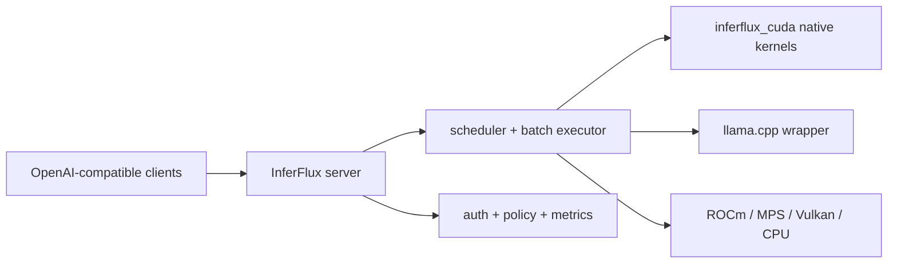

# InferFlux

**InferFlux** is an open-source C++17 inference server exposing an
OpenAI-compatible REST API (SSE streaming included) across **CUDA, ROCm,
Metal (MPS), Vulkan, and CPU**, backed by first-party quantized kernels
*and* an integrated llama.cpp runtime behind one scheduler, auth, policy,
and monitoring surface.

## Measured results

All numbers are greedy decode throughput measured on the hardware listed,
same model file and battery per comparison. Reproduce with the
[multi-backend harness](benchmarks.md#multi-backend-harness-reference); methodology and
run-to-run variance notes in [benchmarks](benchmarks.md).

### AMD Radeon AI PRO R9700 (gfx1201, 32 GB, ROCm 7.2) — Sep 13 2026

Qwen2.5-3B Q4_K_M and four production-class models, 48×256-token battery,
16 concurrent, vs a stock llama.cpp server built from the same pinned
source:

| Model | Stock llama.cpp | InferFlux | Delta |
|---|---:|---:|---|
| Qwen2.5-3B Q4_K_M (dense) | 992 tok/s | 1067 tok/s | **+8%** |
| LFM2.5-8B-A1B Q4_K_M (hybrid MoE) | 861 tok/s | 1089 tok/s | **+26%** |
| gpt-oss-20b MXFP4 (MoE) | 598 tok/s | 710 tok/s | **+19%** |
| Qwen3-30B-A3B Q4_K_M (MoE) | 498 tok/s | 750 tok/s | **+51%** |
| Qwen3-14B Q4_K_M (dense) | 391 tok/s | 388 tok/s | parity |

Single-request streaming TTFT under the production config: ~170 ms.

### NVIDIA RTX 4000 Ada (20 GB, CUDA 12.x) — Qwen2.5-3B Q4_K_M

Native first-party CUDA kernels vs the llama.cpp wrapper and local
competitors: see [Competitive Positioning](COMPETITIVE_POSITIONING.md) for
the full dated tables (native leads llama.cpp up to 1.56× at c=16 on the
32×64-token workload; vLLM/SGLang retain a safetensors decode lead that is
tracked as the open performance target).

## What the scheduler adds over a raw model server

- Continuous batching with priority/age, LPM, and throughput-balanced
  selection, chunked prefill, and wave-gathering admission
- Per-tenant fairness with yield/resume, prefix-cache reuse (radix trie),
  speculative decoding hooks, disaggregated prefill/decode pools
- API-key + OIDC auth, policy/guardrail enforcement, Prometheus metrics,
  audit logging, crash diagnostics
- OpenAI-compatible surface: [API reference](API_SURFACE.md)

## Where to go next

| Goal | Start here |
|---|---|
| Run it locally | [Quickstart](Quickstart.md) |
| Serve on an AMD GPU | [ROCm on WSL2](ROCM_INSTALLATION_GUIDE_WSL.md) |
| Configure everything | [Configuration Reference](CONFIG_REFERENCE.md) |
| Understand the architecture | [Architecture](Architecture.md) |
| Compare against other servers | [Competitive Positioning](COMPETITIVE_POSITIONING.md) |
