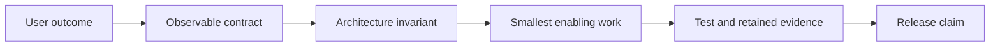

# Planning Principles and Prioritization

**Status:** Proposed for co-design

**Snapshot date:** August 21, 2026

## First-Principles Rules

| Rule | Consequence |
|---|---|
| A result is not a capability until it is repeatable | Benchmarks require provenance, reliability, and quality gates |
| State has one owner | Sequence, KV, session, adapter, and tenant cleanup need explicit lifecycles |
| Local and remote are transport choices | `inferctl` must not fork a second inference implementation |
| Compatibility is observable | Requested provider, selected provider, and fallback reason remain machine-visible |
| Scale follows correctness | Distributed topology work waits for single-node lifecycle and failure contracts |
| Security scopes reuse | Tenant identity participates in cache, adapter, policy, metrics, and audit keys |

## Prioritization Model

Score each candidate from 1–5 for user outcome, risk reduction, strategic fit,
and dependency unlock. Divide the sum by estimated engineering weeks. Scores
rank discovery and sequencing; acceptance evidence, not the score, authorizes release.

| Candidate | Outcome | Risk | Fit | Unlock | Effort | Relative score |
|---|---:|---:|---:|---:|---:|---:|
| Green mainline and CI truth | 5 | 5 | 5 | 5 | 2 | 10.0 |
| Dependency/runtime currency | 4 | 5 | 5 | 5 | 2 | 9.5 |
| Context and sequence capacity | 5 | 5 | 5 | 5 | 3 | 6.7 |
| Native-runtime proof-or-pivot | 4 | 5 | 5 | 5 | 2 | 9.5 |
| Managed local/endpoint CLI | 5 | 3 | 5 | 4 | 3 | 5.7 |
| Agent API and structured output | 5 | 4 | 5 | 4 | 5 | 3.6 |
| Tenant-safe adapters/cache | 4 | 5 | 5 | 4 | 5 | 3.6 |
| SLO-aware serving | 4 | 4 | 5 | 4 | 5 | 3.4 |
| Distributed lifecycle | 3 | 5 | 4 | 2 | 8 | 1.8 |

## Evidence Hierarchy

1. Deterministic unit and contract tests.
2. Model-free integration tests from clean and non-default build directories.
3. Model-backed correctness and failure-path tests.
4. Retained performance matrices with hardware, model, revision, config, and raw results.
5. Competitive or release claims only after steps 1–4 agree.

## Co-Design Checkpoints

| Checkpoint | Decision required |
|---|---|
| ADR review | Accept, revise, or reject the proposed invariant before dependent implementation |
| Runtime evidence | Continue native investment, narrow its supported envelope, or pivot |
| Local UX prototype | Confirm autostart policy and endpoint/context precedence |
| Tenant contract | Confirm identity source and isolation threat model |
| Distributed proof | Confirm the next topology solves a measured SLO/cost constraint |
