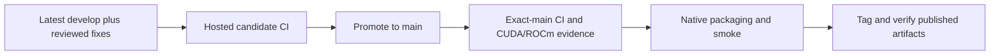

# InferFlux v0.3.0 release candidate

**Status: In Progress — candidate implementation reviewed; promotion and publication pending.**

The release preparation previously merged to main at `274b74bc0715604cbd9f8ab573c5e369da35c71c`.
The candidate was then rebased onto develop `d10b5bbc5507f6dfacac9165cf04ed140dd462a0` before
new CI, broadening the release to include #179 and the review fixes described below.

| Scope | Candidate behavior | Status |
|---|---|---|
| Origin contract | Usage, identity, errors, latency, reasoning/content separation | Implemented; model-free evidence below |
| Tool calls (#179 plus review fixes) | Multiple calls preserve source order; ordinary nested JSON stays content; tool streams preserve reasoning, prose, and usage | Implemented; CPU regressions pass |
| KV sequence capacity (#179 plus review fixes) | Context-owned llama bounds; conservative startup capacity across models; bounded per-request leases | Implemented; CPU regressions pass; accelerator evidence pending |
| Package portability | Windows date conversion fix, MSVC renderer CI, native installer/archive smoke before upload | Implemented; hosted/native execution pending for the broadened candidate |
| Publication | Immutable v0.3.0 tag, packages, manifests, checksums | Pending |

## Three-way origin contract

- Request identity, resolved model, OpenAI-shaped errors, exact usage/cache counts, duration,
  and streaming time-to-first-token are produced at the origin (#170).
- Think-tag and harmony reasoning stay separate from visible content in buffered and streamed
  responses; terminal usage carries the reasoning count (#171, #174, #176).
- Model-free fixtures exercise both reasoning families and secured-header compatibility.
- `/v1/tokenize` and ADR-0006 document source-owned tokenization (#177). Sandhi reservation
  calibration does not call this endpoint or introduce a second tokenizer.

Sandhi TD-0027 pins `273780835f120cbe1a8da4860d72905861e71e29` (#176), an ancestor of this
candidate. The broadened candidate's CPU binary also passed 16 Sandhi origin cases plus two
actual Victor binding/proxy/origin cases on 2026-09-17, using the candidate Sandhi wheel and
rebased Victor source. This supersedes the earlier `1531eddb` candidate probe, but does not
test an installed published Sandhi 0.7.0 wheel. These checks use no loaded model and establish
no GPU claims; rerun against final release sources and published consumer dependencies.

## Develop integration and review fixes

#179 adds multi-tool-call responses and coordinates KV sequence capacity. Independent review
found four issues in that integration; the candidate fixes mixed-format call reordering,
streamed reasoning/prose/usage loss, process-global llama sequence bounds, and nested ordinary
JSON being interpreted as tool calls. Tests exercise both the real HTTP handler and scheduler.

#179 also narrows keyword guardrails to raw completion prompts and user-role chat turns;
system/tool context is excluded. Full-context policy remains the OPA path. Relative policy-store
resolution and ROCm example configurations are included in the develop baseline.

Other integrated changes include llama.cpp refresh, KV lifecycle fixes, ROCm scheduling and
sampling improvements, and documentation consolidation. The tag's generated notes enumerate
the full main history; this focused co-design summary is not an independent GPU-code review.

Preflight diagnosed main packaging run 35008475215: MSVC rejected the POSIX-only `gmtime_r`
introduced in the harmony renderer. This candidate uses the Windows thread-safe equivalent
and adds a small MSVC renderer-test gate before publication; rerunning the failed packaging
unchanged would not fix it. The existing registered GPU listener was offline and was restarted
without registration changes; exact-source runtime evidence remains mandatory.

## Completed local verification

The reviewed source snapshot is commit `22329d53a6e8f99e5ace321a1a276781a4dfed31` plus the
14-file review-fix diff (binary-diff SHA-256
`5de2816dd9ea1fb94e0af18342d243e7c7c7849439c2ecbf4a3a79bc25d71f9d`). The subsequent documentation
update does not change that tested code; final committed revision evidence must still be recorded.

| Evidence | Result | Provenance and limits |
|---|---|---|
| CPU build and complete configured CTest suite | 47/47 groups passed | Implementer execution; CPU build, no loaded-model or GPU claim |
| Focused tool/reasoning/scheduler cases | 70 cases, 872 assertions passed | Implementer execution, including live HTTP and model-load-order capacity |
| Independent parser/capacity regressions | 21 cases, 200 assertions passed | Reviewer rerun against the built candidate |
| Independent live tool-stream regression | 1 case, 23 assertions passed | Real local HTTP; reasoning, prose, tool call, and one terminal usage frame |
| Package-smoke orchestration | 8 offline tests passed | Native installer commands mocked; native jobs remain required |
| Source review | Four findings resolved; no new blocker found | Independent review of all 14 fix files; not release approval |
| Three-repository origin probes | 18 cases passed | Broadened candidate CPU binary, candidate Sandhi wheel, rebased Victor source; published-package validation pending |

## Required release evidence

- Commit the reviewed candidate, pass hosted CI (including MSVC), and promote through the
  protected branch workflow. Re-run final-source checks after any further code change.
- Green portable CI and exact-main `Dual-GPU gate result`, per ADR-0005, with both CUDA and
  ROCm jobs actually successful and matching SHA-qualified artifacts. A disabled/skipped
  aggregate is not runtime evidence. Do not run PR code on the persistent GPU runner.
- Before tagging, require successful exact-SHA main pre-release packaging and smoke-test its
  installers, as required by the [canonical release runbook](../ReleaseProcess.md).
- Tag v0.3.0 only after those gates, then verify the tagged Linux x86/arm, macOS, Windows
  packages, manifests, and checksums from the existing release workflow.
- Earlier main GPU success and earlier candidate conformance do not satisfy these gates for
  the rebased candidate. The remaining steps follow the [canonical runbook](../ReleaseProcess.md).
- Sandhi v0.7.0 and Victor v0.9.5 are separately versioned consumers; they must be published and
  verified independently. No GPU or Windows runner registration changes belong to Sandhi.

Rollback before tagging: revert the package-version bump through a reviewed PR. After tagging,
never move the tag or overwrite artifacts; fix forward with a new version if necessary.
