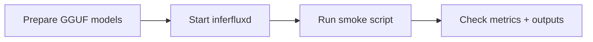

# Scripts

Supported entry points:

- `scripts/benchmark.sh`
  - `gguf-compare`
  - `multi-backend`
  - `throughput-gate`
  - `multi-backend` compares:
    - `inferflux_cuda`
    - `llama_cpp_cuda`
    - `ollama`
    - `lmstudio`
    - `vllm`
    - `sglang`
- `scripts/profile.sh`
  - `backend`
  - `backend-ncu`
  - `phase-timing`
  - `analyze-nsys`
- `scripts/smoke.sh`
  - `gguf-native`
  - `backend-identity`
- direct helpers that remain first-class because other tooling imports or calls them:
  - `build.sh`
  - `run_dev.sh`
  - `run_gguf_comparison_benchmark.sh`
  - `benchmark_multi_backend_comparison.sh`
  - `run_throughput_gate.py`
  - `profile_backend.sh`
  - `profile_backend_ncu.sh`
  - `parse_native_phase_timing.py`
  - `analyze_nsys_results.py`
  - `extract_native_dispatch_winners.py`
  - `classify_benchmark_response.py`
  - `check_backend_identity.py`
  - `check_docs_contract.py`
  - `generate_sbom.py`
  - `test_gguf_native_smoke.py`
  - `compare_decode_traces.py`

Archive policy:

- One-off probes, temporary experiments, and superseded wrappers live under `scripts/archive/`.
- New script additions should prefer extending the supported entry points above over creating new top-level files.

Multi-backend harness behavior:

- `benchmark_multi_backend_comparison.sh` runs each backend in an isolated child process.
- This is deliberate. It prevents local CUDA backends from sharing allocator / stream / process state during the same benchmark session.
- Use `INFERFLUX_BENCH_SINGLE_BACKEND=<backend_id>` to run one backend through the same harness path while keeping the same artifact layout.

External engine notes:

- `vllm` and `sglang` are treated as OpenAI-compatible HTTP backends in the multi-backend benchmark.
- They can either be pre-started externally or auto-launched locally by the harness.
- Set `AUTOSTART_VLLM=true` and/or `AUTOSTART_SGLANG=true` to have the benchmark launch and tear them down one at a time.
- Stock `llama-server` comparison: build it out-of-tree from the pinned
  submodule with a conda-free environment — the operative fix is `env -i`
  (anaconda's sysroot libm otherwise breaks the link; apply it to BOTH the
  configure and build steps): `env -i PATH=/usr/local/cuda/bin:/usr/bin:/bin
  HOME=$HOME cmake -S external/llama.cpp -B /tmp/llama-server-build
  -DGGML_CUDA=ON -DCMAKE_BUILD_TYPE=Release && env -i
  PATH=/usr/local/cuda/bin:/usr/bin:/bin HOME=$HOME cmake --build
  /tmp/llama-server-build --target llama-server`. Suggested flags to mirror
  the tuned wrapper: `-ngl 99 -c 4096 -np 16 -fa on`.
- When the ROCm toolchain is installed system-wide (e.g. `/usr/bin/hipcc`), SGLang's kernel JIT misdetects HIP and fails to build. Export `TVM_FFI_GPU_BACKEND=cuda` for the benchmark (or globally) to force the CUDA toolchain.
- Use `VLLM_MODEL` / `SGLANG_MODEL` to override auto-discovery from `/v1/models`.
- Use `VLLM_MODEL_PATH` / `SGLANG_MODEL_PATH` to point local autostart at a safetensors model directory.
- Use `SGLANG_PYTHON` if you need to override the default `./.venv-sglang/bin/python -m sglang.launch_server` entrypoint.
- The harness auto-detects the supplied model format and only runs compatible backends.
- In practice:
  - GGUF runs include `inferflux_cuda`, `llama_cpp_cuda`, `ollama`, and other GGUF-capable engines.
  - Safetensors runs include `inferflux_cuda`, `vllm`, `sglang`, and other safetensors-capable engines.

## GGUF Native Smoke Test


**Status:** Canonical



## 1) Preconditions

| Requirement | Check |
|---|---|
| Built binaries | `cmake --build build --target inferfluxd inferctl` |
| GGUF model files | directory contains `*.gguf` variants |
| CUDA visibility (if GPU path) | `nvidia-smi` |

## 2) Fast Path (Recommended)

```bash
./scripts/smoke.sh gguf-native \
  --model-dir ~/.inferflux/models/qwen-gguf \
  --num-tokens 20
```

Expected: each supported quantization variant reports `SUCCESS`.

## 3) Full Comparison Path (Optional)

```bash
./scripts/archive/test/test_gguf_quantization_smoke.sh (moved to the archive) \
  --model-path /abs/path/to/source-model \
  --num-tokens 20
```

Use this when you want native-vs-llama.cpp comparison behavior in one flow.

## 4) Post-Run Verification

```bash
curl -s http://127.0.0.1:8080/metrics | grep -E "inferflux_cuda_forward_passes_total|inferflux_cuda_kv_active_sequences"
./build/inferctl models --json --api-key dev-key-123
```

## 5) Failure Matrix

| Failure | First check | Action |
|---|---|---|
| server startup failure | server log, model path, port | fix config/path and restart |
| inference failure | model format/backend exposure | enforce `format: gguf`, verify backend policy |
| empty output | prompt/model mismatch | test with simpler prompt and higher token budget |
| low performance | batch/skip metrics | tune scheduler and CUDA settings |

## 6) Consolidation Notes

The previous long-form smoke guide is cataloged (name only, no working tree
copy) in [ARCHIVE_INDEX](ARCHIVE_INDEX.md).

